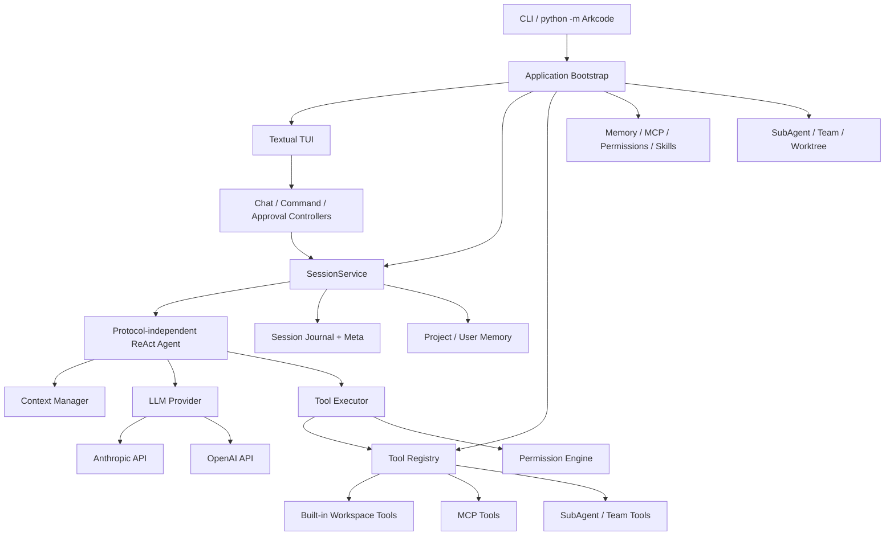

# ArkCode

ArkCode 是一个运行在终端中的多协议 AI 编程与对话客户端。项目以 Textual
构建交互界面，通过统一的 Provider 抽象接入 Anthropic、OpenAI 及其兼容端点，
并在核心对话能力之上提供工具调用、权限审批、MCP、上下文压缩、持久化会话、
长期记忆、Skills、SubAgent、Agent Team 和 Git Worktree 隔离等能力。

当前版本：`0.1.0`。

## 核心能力

- 多 Provider：支持 `anthropic`、`openai` 两种协议和自定义兼容端点。
- 流式 ReAct Agent：模型可在单轮中多次推理、调用工具并继续生成结果。
- 内置工作区工具：文件读取、写入、编辑、Glob、Grep 和 Bash。
- 权限与沙箱：按用户、项目和本地三级规则裁决工具调用，支持交互审批与操作模式切换。
- MCP：支持 stdio 和 Streamable HTTP Server，并将远端工具动态注册到统一工具表。
- 会话与上下文：JSONL 会话持久化、历史恢复、自动/手动压缩和超长上下文恢复。
- 长期记忆：从对话中异步提取、合并项目级和用户级记忆。
- Skills：从项目级或用户级目录加载 Markdown Skill，支持热重载与安装。
- 多 Agent：支持前台或后台 SubAgent、任务查询与消息传递。
- Agent Team：支持 tmux、iTerm2 或进程内后端，以及团队邮箱和共享任务。
- Worktree：为人工任务或 SubAgent 创建独立 Git Worktree，隔离执行目录与代码变更。

## 架构设计

ArkCode 采用“组合根 + 分层领域模块”的结构。具体对象只在
`application/bootstrap.py` 中装配，界面和领域逻辑依赖抽象接口，Provider、工具、
权限和持久化实现可以独立演进。



### 1. 入口与生命周期

`Arkcode.__main__` 将请求交给 `application.cli`。CLI 在同一个 asyncio 事件循环中：

1. 调用 `build_runtime()` 构建进程级依赖；
2. 创建并运行 Textual 应用；
3. 退出时依次关闭 Session、Memory、SubAgent 任务、后台任务和 MCP 连接。

`ApplicationRuntime` 显式持有这些长生命周期对象，避免散落的全局状态。

### 2. 会话与 Agent 执行链

`SessionService` 是当前会话的所有权边界，负责 Provider、Agent、Conversation、
Journal、SkillExecutor 及当前 Worktree 路径。一次输入的主要调用链为：

```text
TUI 输入
  -> ChatController
  -> SessionService.submit_message()
  -> Agent.run()
  -> 构建系统提示与召回记忆
  -> 检查/压缩上下文
  -> Provider 流式请求
  -> ToolExecutor 权限裁决与工具执行
  -> 工具结果回填模型，直到返回最终答案
  -> Conversation / SessionJournal 持久化
```

只读工具可批量并发执行；有副作用的工具按顺序执行。单轮默认最多执行 25 次
Agent 迭代，避免异常调用链无限循环。

### 3. LLM Provider 抽象

`llm/` 定义统一的消息、请求、流事件、工具调用和 Provider 接口；
`llm/providers/anthropic.py` 与 `llm/providers/openai.py` 负责协议适配。
因此 Agent、会话和 TUI 不直接依赖具体 SDK。

### 4. 工具、权限与沙箱

所有工具统一进入 `tools.Registry`。默认注册六个工作区工具，启动时再加入 MCP、
Skill、SubAgent 和 Team 工具。权限引擎在执行前依次处理：

- 危险 Bash 命令黑名单；
- 文件路径是否越出项目根目录；
- 本地、项目、用户三级 `allow` / `ask` / `deny` 规则；
- 当前模式的默认策略；
- 必要时通过 TUI 或 SubAgent ApprovalBroker 请求人工确认。

Plan 模式只暴露只读工具。系统沙箱实现位于 `sandbox/`，macOS 使用 Seatbelt，
Linux 使用 Bubblewrap（可用时）。

### 5. MCP 扩展

MCP 配置由用户级 `~/.Arkcode/config.yaml` 与项目级
`.Arkcode/settings.yaml` 合并，项目配置覆盖同名用户配置。MCP Manager 并发连接
各 Server，单个连接失败不会阻止应用启动；远端工具采用
`mcp__<server>__<tool>` 命名，并支持断线后重连一次。

### 6. 会话、上下文与记忆

- 会话保存在 `.Arkcode/sessions/<session-id>/`，使用 JSONL Journal 记录消息和压缩边界，
  `meta.json` 保存标题、Provider、模型和时间等索引信息。
- 上下文管理根据模型窗口估算 token，在接近上限时生成结构化摘要；也可使用
  `/compact` 手动压缩。
- 项目记忆位于 `.Arkcode/memory/`，用户记忆位于 `~/.Arkcode/memory/`；
  `MEMORY.md` 是生成的索引。
- 项目指令按 `./ArkCODE.md`、`./.Arkcode/ArkCODE.md`、
  `~/.Arkcode/ArkCODE.md` 的顺序加载，并支持受目录边界保护的 `@include`。

### 7. Skills、SubAgent、Team 与 Worktree

- Skills 从 `.Arkcode/skills/` 和 `~/.Arkcode/skills/` 加载，项目级同名 Skill 优先。
- SubAgent 定义按内置、用户级 `~/.Arkcode/agents/`、项目级
  `.Arkcode/agents/` 的顺序覆盖。
- Agent Team 自动选择 tmux、iTerm2 或进程内后端，通过邮箱和共享任务协调成员。
- Worktree Manager 在 `.Arkcode/worktrees/` 维护隔离工作区、Manifest 和会话状态，
  主 Agent 切换工作区时不修改进程级 `cwd`，而是使用显式执行路径上下文。

### 8. 架构约束

`tests/architecture/` 持续验证以下规则：

- 领域模块不依赖 `application` 或 `tui`；
- TUI 不导入具体 Provider 实现；
- Memory、工具、权限和 MCP 等具体对象的构造集中在 `application` 组合根。

## 项目结构

```text
ArkCode/
├── src/Arkcode/
│   ├── application/    # CLI、进程组合根、SessionService、生命周期
│   ├── tui/            # Textual App、Controller、View、Widget、流式状态
│   ├── agents/         # ReAct 循环、流式事件、工具执行、身份与运行状态
│   ├── llm/            # Provider 抽象及 Anthropic/OpenAI 适配器
│   ├── tools/          # 工具协议、Registry、内置工具及延迟发现
│   ├── permissions/    # 权限模式、规则引擎、审批与规则持久化
│   ├── sandbox/        # macOS Seatbelt / Linux Bubblewrap 适配
│   ├── commands/       # Slash Command 解析、注册、分发与处理器
│   ├── conversations/  # 对话消息集合与持久化 Sink
│   ├── sessions/       # JSONL Journal、元数据、恢复、清理
│   ├── context/        # token 估算、摘要压缩、溢出与恢复
│   ├── memory/         # 记忆召回、提取、合并与 Markdown Store
│   ├── mcp/            # MCP 配置、连接管理和工具适配
│   ├── skills/         # Skill 解析、加载、安装与执行
│   ├── subagents/      # SubAgent Catalog、启动、任务与审批
│   ├── teams/          # Agent Team、后端、邮箱和共享任务
│   ├── worktrees/      # Git Worktree 生命周期与执行路径隔离
│   ├── prompts/        # 系统提示、环境、提醒与目录渲染
│   ├── instructions/   # ArkCODE.md 与 include 加载
│   └── config/         # 环境变量配置模型与校验
├── tests/              # 单元、集成、架构和行为契约测试
├── docs/               # MCP 示例及设计/实施文档
├── examples/           # 示例代码
├── pyproject.toml      # Python 包、依赖和工具配置
└── uv.lock             # uv 锁文件
```

## 环境要求

- Python 3.12 或更高版本
- 可用的 LLM API Key
- 推荐使用 [uv](https://docs.astral.sh/uv/) 管理依赖
- Worktree 功能需要当前目录是 Git 仓库
- Team 的多窗格能力可选依赖 tmux 或 iTerm2；缺失时使用进程内后端

## 安装

在项目根目录执行：

```bash
uv sync
```

也可以使用标准虚拟环境：

```bash
python3.12 -m venv .venv
source .venv/bin/activate
python -m pip install -e .
```

## 配置 Provider

复制配置模板：

```bash
cp .env.example .env
```

编辑 `.env`：

```dotenv
ARKCODE_PROVIDERS=anthropic,openai

ARKCODE_ANTHROPIC_PROTOCOL=anthropic
ARKCODE_ANTHROPIC_MODEL=claude-sonnet-4-5
ARKCODE_ANTHROPIC_BASE_URL=
ARKCODE_ANTHROPIC_API_KEY=replace-with-your-anthropic-key
ARKCODE_ANTHROPIC_THINKING=true
ARKCODE_ANTHROPIC_CONTEXT_WINDOW=200000

ARKCODE_OPENAI_PROTOCOL=openai
ARKCODE_OPENAI_MODEL=gpt-5
ARKCODE_OPENAI_BASE_URL=
ARKCODE_OPENAI_API_KEY=replace-with-your-openai-key
ARKCODE_OPENAI_THINKING=false
ARKCODE_OPENAI_CONTEXT_WINDOW=128000

# 可选功能开关
ARKCODE_ENABLE_SUBAGENT_BACKGROUND=true
ARKCODE_FEATURE_COORDINATOR_MODE=false
```

配置规则：

- `ARKCODE_PROVIDERS` 是逗号分隔的 Provider 列表，也决定启动选择顺序。
- Provider 名称仅允许字母、数字和下划线，且不区分大小写重复。
- 每个 Provider 使用 `ARKCODE_<大写名称>_` 前缀。
- `PROTOCOL`、`MODEL`、`API_KEY` 必填；协议仅支持 `anthropic` 或 `openai`。
- `BASE_URL` 可留空；连接兼容服务时填写对应 API 地址。
- `THINKING` 仅接受 `true` 或 `false`，默认为 `false`。
- `CONTEXT_WINDOW` 必须是非负整数；`0` 表示使用协议默认值：OpenAI
  为 128000，Anthropic 为 200000。
- `.env` 会覆盖同名系统环境变量，请勿提交真实密钥。

## 启动

应用从当前目录读取 `.env`，因此应在项目根目录执行：

```bash
uv run python -m Arkcode
```

查看版本：

```bash
uv run python -m Arkcode --version
```

配置多个 Provider 时，启动后使用方向键选择并按 Enter 确认。

### 键盘操作

| 按键 | 作用 |
| --- | --- |
| Enter | 发送消息 |
| Alt+Enter | 在输入框中换行 |
| Escape | 取消当前轮次 |
| Shift+Tab | 切换权限模式 |
| Ctrl+C | 退出应用 |

## Slash Commands

输入 `/help` 查看完整帮助；主要命令如下：

| 命令 | 作用 |
| --- | --- |
| `/status` | 显示 Provider、模型、模式和运行状态 |
| `/session [list \| resume <id> \| new \| delete <id>]` | 管理持久化会话 |
| `/resume` | 打开历史会话恢复界面 |
| `/clear` | 清空当前对话并开启新会话 |
| `/compact` | 立即压缩当前上下文 |
| `/memory [list \| clear \| edit]` | 查看或管理长期记忆 |
| `/plan` | 切换到只读计划模式 |
| `/do` | 执行已确认的计划 |
| `/review` | 请求审查当前上下文 |
| `/permission` | 显示当前权限模式 |
| `/sandbox [on-auto \| on \| off]` | 管理系统沙箱 |
| `/mcp` | 显示 MCP Server 连接状态 |
| `/worktree create/list/enter/exit/remove` | 管理隔离 Worktree |
| `/team list/info/delete/kill` | 查看和管理 Agent Team |
| `/exit` | 退出 ArkCode |

## 配置 MCP

项目级 MCP Server 写入 `.Arkcode/settings.yaml`，用户级写入
`~/.Arkcode/config.yaml`。仓库提供了[完整示例](docs/mcp/mcp-servers.example.yaml)：

```yaml
mcp_servers:
  local-sqlite:
    type: stdio
    command: uvx
    args: [mcp-server-sqlite, --db-path, ./example.db]

  remote-service:
    type: http
    url: https://example.com/mcp
    headers:
      Authorization: "Bearer ${EXAMPLE_TOKEN}"
```

`env` 和 `headers` 中可以使用 `${VARIABLE}` 引用环境变量。使用 `/mcp`
检查配置数量、连接结果和注册工具数。

## 配置项目权限

权限配置可位于：

1. `~/.Arkcode/settings.yaml`：用户级；
2. `.Arkcode/settings.yaml`：项目级；
3. `.Arkcode/settings.local.yaml`：本地级，优先级最高，适合不提交的个人规则。

示例：

```yaml
default_mode: default
permissions:
  allow:
    - Read
    - Glob
    - Grep
    - Write(src/**)
  ask:
    - Bash(git *)
  deny:
    - Bash(rm *)
```

可用模式包括 `default`、`acceptEdits`、`plan`、`bypassPermissions` 和
`dontAsk`。无论模式如何，危险命令黑名单和项目目录边界仍会优先检查。

## 开发与验证

```bash
uv run pytest
uv run ruff check .
uv run ruff format --check .
uv run mypy src/Arkcode
```

只运行架构约束测试：

```bash
uv run pytest tests/architecture
```

## 常见问题

- `配置文件不存在: .env`：确认当前目录是项目根目录，并已复制 `.env.example`。
- `ARKCODE_PROVIDERS 不能为空`：至少配置一个 Provider。
- `ARKCODE_<NAME>_API_KEY 不能为空`：为对应 Provider 填写 API Key。
- MCP 连接失败：运行 `/mcp` 查看具体 Server 状态，并检查命令、URL 和环境变量。
- Worktree 功能未启用：确认当前目录是 Git 仓库根目录且 Git 可用。
- tmux/iTerm2 不可用：Team 会自动降级到进程内后端，不影响基础对话和 SubAgent。
